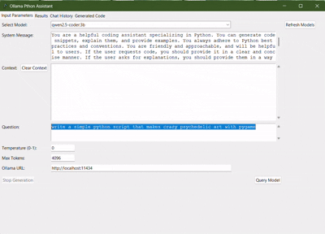

# Ollama Python Assistant: Code Locally with AI! 💻

This app lets you harness the power of local language models through Ollama to generate, run, and understand Python code. It's your personal coding assistant that works entirely offline!

## What Can It Do? ✨

*   **Talk to AI Models:** Connects to different language models through Ollama, letting you compare their code suggestions.
*   **Super Simple Interface:** Built with Tkinter, it's designed to be clean and intuitive, so you can focus on coding, not complicated menus.
*   **Code Generation & Execution:** Not only can it generate Python code snippets, but it also lets you run them directly within the app!
*   **Keeps Track of Your Chats:** Remembers your prompts and the model's responses, so you can easily refer back to previous conversations.
*   **Remembers the Context:** You can provide context to the model, making the generated code even more relevant to your specific needs.
*   **Tweak the Settings:** Adjust parameters like temperature and max tokens to fine-tune the model's output.
*   **Edit & Run:** Modify the generated code to fit your exact requirements, then run it with a click.
*   **Save & Load:** Save your code snippets for later use, or load existing code into the app.
*   **Interactive Code:** Send input to your running code, allowing for interactive programs.

## Getting Started 🚀

### 1. Install Ollama

First, you'll need to install Ollama, which is what lets you run language models locally.

*   **Head over to the [Ollama website](https://ollama.com/)** and follow the installation instructions for your operating system.
*   **Run Ollama.** Once installed, make sure Ollama is running in the background. This app connects to Ollama to access the language models.

### 2. Get the Code

*   download the zip and extract it somewhere

### 3. Set up the Environment

*   **Make sure you have Python 3.x installed.** If not, download it from [python.org](https://www.python.org/downloads/).
*   **Install Tkinter:** Tkinter should come pre-installed with Python on most systems. If not, you may need to install it separately.

### 4. Launch the Assistant! 🚀

Here's the easiest way to get your AI coding buddy up and running:

*   **Find the Script:** Open the folder where you saved `OllamaCoder.py`.
*   **Double-Click:** Just double-click the `OllamaCoder.py` file!

    This should automatically launch the script using Python.

*   **The Ollama Python Assistant window will pop up, ready for action!** 🎉

### 5. Using the App

1.  **Select a Model:** Choose a language model from the dropdown. If the list is empty, click "Refresh Models". Make sure you have models installed in Ollama. You can install models by running `ollama pull <model_name>` in your terminal. For example, `ollama pull qwen2.5-coder:3b`.
2.  **Write a System Message:** This tells the model what kind of assistant it should be. The default is a helpful Python coding assistant.
3.  **Add Context:** Provide any relevant information that the model should consider when generating code.
4.  **Ask a Question:** Enter your coding question or request.
5.  **Tweak the Parameters:** Adjust the temperature (creativity) and max tokens (length of the response) as needed.
6.  **Click "Query Model":** Sit back and watch the magic happen!
7.  **Review the Results:** The model's response will appear in the "Results" tab.
8.  **Run the Code:** If the model generates Python code, it will appear in the "Generated Code" tab. Click "Run Code" to execute it.
9.  **Edit the Code:** Click "Edit Code" to modify the generated code before running it.
10. **Save/Load Code:** Save your code snippets for later use, or load existing code into the app.
11. **Send Input:** If your code requires input, enter it in the "Input to Code" field and click "Send Input".

## The `utils` Folder 🧰

This folder contains helper scripts that make the app work:

*   `ollama_api.py`: This script handles communication with the Ollama API. It fetches the available models and sends queries to the selected model.
*   `code_execution.py`: This script executes the generated Python code in a separate subprocess and captures the output (stdout and stderr). It also handles stopping the code execution if requested by the user.
*   `file_operations.py`: This script provides functions for saving the generated code to a file and loading code from a file into the application.
